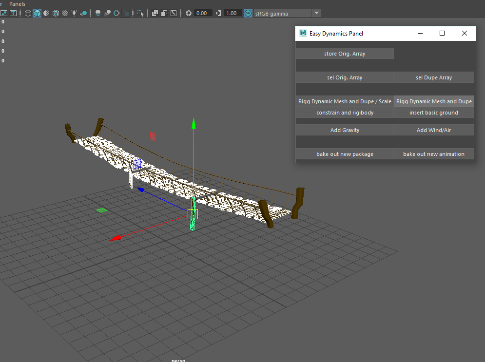
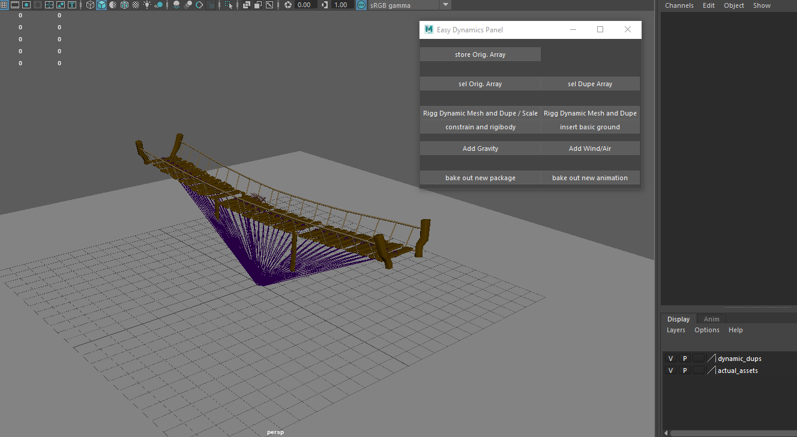
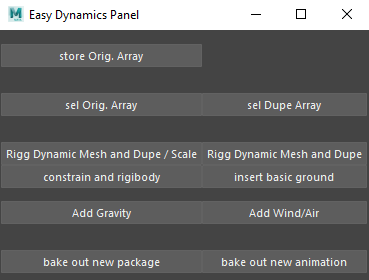

# Pythonic Dynamics Rigging Tool written for Autodesk Maya 2018

    A script to rig environmental destruction dynamics in autodesk maya for the purpose od making environmental destrustion animations for games

## Prerequisites:

* PyQt5
* Autodesk Maya 2018

## Built with:

* PyQt5
* Maya.cmds

## How to use:

### Phase 1: Rig the mesh(s):
1. Select the meshes involved in the asset
2. Store the selection

3. Make the duplicate meshes and rig for the selection 

### Phase 2: Add solver(s) and ground plane:
1. Add a groud plane with a passive rigid body attached
2. Add a gravity solver
3. Optional* Add a wind solver

### Phase 3: Bake the Animation based on the time slider's range:
1. A. Bake the animation and export an FBX package including the mesh
    B. If this is for an existing rigged asset, bake and export just the animation as an FBX file.

## Main UI window wireframe:

    Quick wireframe design of the main dialog window for the tool, made in QtDesigner:

